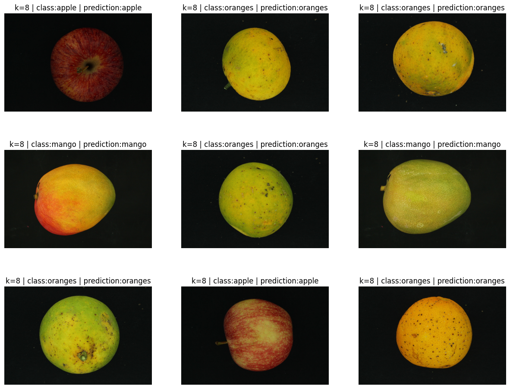

# Fruit classifier

I saw this dataset and thought that maybe i could manually do some functions of Image Processing and Machine Learning on my own to practice python and data science.

## Histogram of oriented gradients

Histogram of Oriented Gradients (HOG) is a feature descriptor algorithm used in computer vision and image processing for the purpose of object detection. The technique counts occurrences of gradient orientation in the localized portion of an image, focusing on the structure or the shape of an object. It generates histograms using the magnitude as well as the angle/orientations of the gradient to compute the features unlike other edge descriptors.

## K-nearest neighbors

The k-nearest neighbors algorithm (KNN) is a non-parametric, supervised learning classifier, which uses proximity to make classifications or predictions about the grouping of an individual data point. It works by the assumption that similar points can be found near one another and is typically used as a classification algorithm although it can solve regression problems too.

## Results

With dataset preprocessed, the accuracy was 91.38%.



## Installation

In Linux/Unix

```bash
$ python -m venv venv
$ source venv/bin/activate
$ pip install --upgrade pip
$ pip install -r requirements.txt
```

In Windows

```bash
$ python -m venv venv
$ venv/Scripts/activate
$ pip install --upgrade pip
$ pip install -r requirements.txt
```
